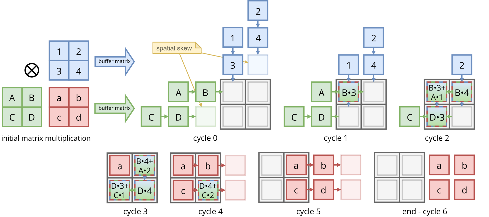
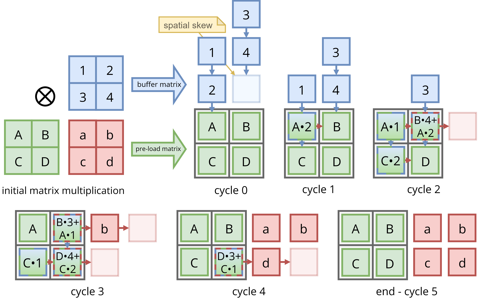

# 脉动阵列（Systolic Array）

## 1. 介绍

本目录提供一个 **二维脉动阵列** 的 Python 仿真，用于计算矩阵乘法。

- 输入矩阵：`A` 的形状是 `(m, k)`，`B` 的形状是 `(k, n)`
- 输出矩阵：`C = A @ B`，形状是 `(m, n)`

阵列由 `m × n` 个处理单元（PE）组成。每个 PE 在每个周期执行一次乘加（MAC）：

- `acc[i, j] = acc[i, j] + in_a * in_b`
- `in_a` 向右传递
- `in_b` 向下传递



### [注意事项](#supplement)

***参考代码中和文档的叙述中，都是以不先存储矩阵的方法展示。***

假如绿色部分是矩阵 `L`，蓝色部分是矩阵 `T`，输出矩阵为 `C`。由上图你可以看出，要生成 `C` 的某一行，需要知道整个矩阵 `T` 的内容，所以在看到完整的 `T` 之前，你实际上无法生成 `C` 的任何一行。

同理，要生成 `C` 的某一列，需要知道整个矩阵 `L` 的内容，所以在看到完整的 `L` 之前，你实际上无法生成 `C` 的任何一列。

正因如此，在真实系统中，通常是先把整个矩阵 `L` 输入到脉动阵列中并存储起来，然后才开始处理矩阵 `T` 的各行；或者把整个矩阵 `T` 输入到脉动阵列中并存储起来，然后才开始处理矩阵 `L` 的各列。

下图展示了把整个矩阵 `L` 输入到脉动阵列中并存储起来，然后才开始处理矩阵 `T` 的各行的情况。



---

## 2. 关键规律（与代码一致）

对于 `A(m×k) @ B(k×n)`：

- **输入倾斜（skew）规则**
  - `A[i, p]` 在周期 `t = i + p` 注入第 `i` 行左侧
  - `B[p, j]` 在周期 `t = j + p` 注入第 `j` 列上侧

- **脉动阵列计算矩阵总耗费周期数**
  - `total_cycles = m + n + k - 2`

---

## 3. 代码说明（[`systolic_array.py`](./systolic_array.py)）

- **`PE (脉动阵列 cell)`**
  - `compute(in_a, in_b)`：执行乘加，保存下一拍输出
  - `clock_tick()`：更新 `out_a` 和 `out_b`

- **`generate_skewed_inputs(A, B)`**
  - 根据 `A`、`B` 生成倾斜输入序列 `A_inputs` 与 `B_inputs`
  - 返回 `A_inputs`、`B_inputs`、`total_cycles`

- **`simulate_systolic_array(A, B)`**
  - 构建 `m × n` 的 PE 网格
  - 每个周期执行“先 compute、后 clock_tick”
  - 返回 `C`、`history`、`A_inputs`、`B_inputs`

- **`print_cycle_history(history)`**
  - 打印每个周期的 PE 累加值

- **`plot_systolic_history(history, m, n)`**
  - 可视化每个周期的数据输入、PE 状态和数据流向

---

## 4. 使用方式

```powershell
python .\systolic_array.py
```

运行后会：

1. 生成并打印 `A_inputs` / `B_inputs`
2. 打印每个周期的累加状态
3. 输出 `C` 与 `A @ B` 对比结果
4. 绘制每个周期的数据流动图

---

<a id="supplement"></a>

## 5. 补充

假设：

- 绿色部分对应矩阵 $L$
- 蓝色部分对应矩阵 $T$
- 输出矩阵为 $C$

并且有：

$$
C = L \times T
$$

### 5.1 矩阵定义

矩阵 $L$ 是一个 $2 \times 2$ 矩阵：

$$
L =
\begin{bmatrix}
l_{00} & l_{01} \\
l_{10} & l_{11}
\end{bmatrix}
$$

矩阵 $T$ 是一个 $2 \times 2$ 矩阵：

$$
T =
\begin{bmatrix}
t_{00} & t_{01} \\
t_{10} & t_{11}
\end{bmatrix}
$$

输出矩阵 $C$ 也是一个 $2 \times 2$ 矩阵：

$$
C =
\begin{bmatrix}
c_{00} & c_{01} \\
c_{10} & c_{11}
\end{bmatrix}
$$

---

### 5.2 矩阵乘法展开

由

$$
C = L \times T
$$

可得：

$$
\begin{aligned}
c_{00} &= l_{00} t_{00} + l_{01} t_{10} \\
c_{01} &= l_{00} t_{01} + l_{01} t_{11} \\
c_{10} &= l_{10} t_{00} + l_{11} t_{10} \\
c_{11} &= l_{10} t_{01} + l_{11} t_{11}
\end{aligned}
$$

---

### 5.3 为什么生成 $C$ 的某一行需要知道整个矩阵 $T$

例如，`C` 的第 0 行为：

$$
\begin{bmatrix}
c_{00} & c_{01}
\end{bmatrix}
$$

其中：

$$
c_{00} = l_{00} t_{00} + l_{01} t_{10}
$$

$$
c_{01} = l_{00} t_{01} + l_{01} t_{11}
$$

可以看到，要计算 $c_{00}$ 和 $c_{01}$，不仅需要矩阵 $L$ 的第 0 行：

$$
\begin{bmatrix}
l_{00} & l_{01}
\end{bmatrix}
$$

还需要矩阵 $T$ 的第 0 列和第 1 列：

$$
\begin{bmatrix}
t_{00} \\
t_{10}
\end{bmatrix},
\quad
\begin{bmatrix}
t_{01} \\
t_{11}
\end{bmatrix}
$$

也就是说，要生成 $C$ 的某一行，实际上需要知道矩阵 $T$ 的完整内容。

---

### 5.4 为什么生成 $C$ 的某一列需要知道整个矩阵 $L$

例如，`C` 的第 0 列为：

$$
\begin{bmatrix}
c_{00} \\
c_{10}
\end{bmatrix}
$$

其中：

$$
c_{00} = l_{00} t_{00} + l_{01} t_{10}
$$

$$
c_{10} = l_{10} t_{00} + l_{11} t_{10}
$$

可以看到，要计算 $c_{00}$ 和 $c_{10}$，不仅需要矩阵 $T$ 的第 0 列：

$$
\begin{bmatrix}
t_{00} \\
t_{10}
\end{bmatrix}
$$

还需要矩阵 $L$ 的第 0 行和第 1 行：

$$
\begin{bmatrix}
l_{00} & l_{01}
\end{bmatrix},
\quad
\begin{bmatrix}
l_{10} & l_{11}
\end{bmatrix}
$$

也就是说，要生成 $C$ 的某一列，实际上需要知道矩阵 $L$ 的完整内容。

---

### 5.5 结合脉动阵列的说明

正因如此，在真实系统中，通常会采用以下两种方式之一：

#### 方式 1：先存储整个矩阵 $L$

先将整个矩阵 $L$ 输入到脉动阵列中并存储起来：

$$
L =
\begin{bmatrix}
l_{00} & l_{01} \\
l_{10} & l_{11}
\end{bmatrix}
$$

然后再开始处理矩阵 $T$ 的各行。

#### 方式 2：先存储整个矩阵 $T$

先将整个矩阵 $T$ 输入到脉动阵列中并存储起来：

$$
T =
\begin{bmatrix}
t_{00} & t_{01} \\
t_{10} & t_{11}
\end{bmatrix}
$$

然后再开始处理矩阵 $L$ 的各列。
